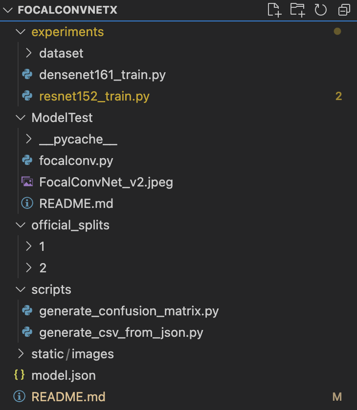

# FocalConvNetX for Video Capsule Endoscopy Classification

## Overview
FocalConvNetX is an enhanced version of the FocalConvNet, designed for the classification of small bowel anatomical landmarks and luminal findings in video capsule endoscopy. This project aims to further improve/enhance the speed and accuracy of FocalConvNet with various methods and techniques.

## Features:
- MongoDB instead of CSV Loading for Kvasir-capsule (Completed)
- Mixed Precising Training (helps reduce memory usuage, Improves speed, Completed)
  - You can test with mixed precision training enabled and disabled to see the results.
- More Improvements adding soon.

## Prerequisites
- Python 3.x
- PyTorch
- MongoDB
- Google Colab (optional, but recommended for training)

## Setting Up MongoDB
To use MongoDB with FocalConvNetX, follow these steps:

1. **Install MongoDB**: Simply Install Pymongo on your GoogleColab.
2. **Configure MongoDB**: Register a free account on MongoDB website and create a free cluster, Make sure to add access from all ip adressess if you are using Colab.
3. **Database Schema**: Ensure your database schema matches the expected format used in the scripts.

## Using FocalConvNetX

### Data Preparation
- Download the Kvasir-Capsule dataset from [here](https://osf.io/dv2ag/).
- Unzip and organize the dataset according to the expected directory structure (refer to the Kvasir-Capsule repository for more details).
- Simple Guide on Folder Structure: Dataset folders should go under official_splits/1 or official_splits/2, It should look like official_splits/1/Ulcer or any other lables. Make sure to equally divide the dataset, You can go for either 70/30 or 50/50, Whatever is your preference.

### Model Training and Testing
1. **FocalConvNet Architecture**: The architecture is defined in `focalconv.py`.
2. **Training Script**: Use the training script provided in the Kvasir-Capsule official repository.
3. **Model Replacement**: In the training script, replace the model definition at Line 308 with the FocalConvNet architecture.
4. **Run Training**: Execute the training script to start the training process. Monitor the training progress and adjust hyperparameters as needed.

## Running the Project on Google Colab
1. **Upload Files**: Upload the dataset, our current repository, and any other necessary files to Google Drive.
2. **Open Colab Notebook**: Launch or Upload the ipynb file on Google Colab to start running the code.
3. **Install Dependencies**: Ensure all required libraries are installed in the Colab environment.
4. **Run Scripts**: Execute your scripts in Colab, taking advantage of the available GPU resources for training. (t4)

## Repository Structure
- `focalconv.py`: Contains the FocalConvNet model architecture.
- `dataloader.py`: Script for loading and preprocessing the dataset.
- `resnet152.py`: Implementation of the ResNet152 model with Mixed Precision Training.
- Other supportive scripts and utility files.

## FAQ and Contact
For any advice or guidance on using this work, please feel free to contact us via email (owensingh82@gmail.com).

## Acknowledgments
This project builds upon the Focal Modulation networks and the Kvasir-Capusle repository. We thank the authors for their well-organized code and contributions to the field.
